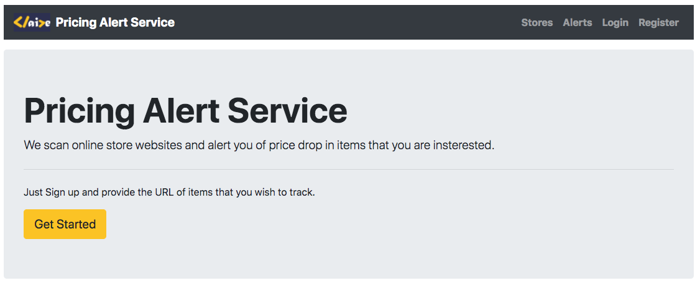
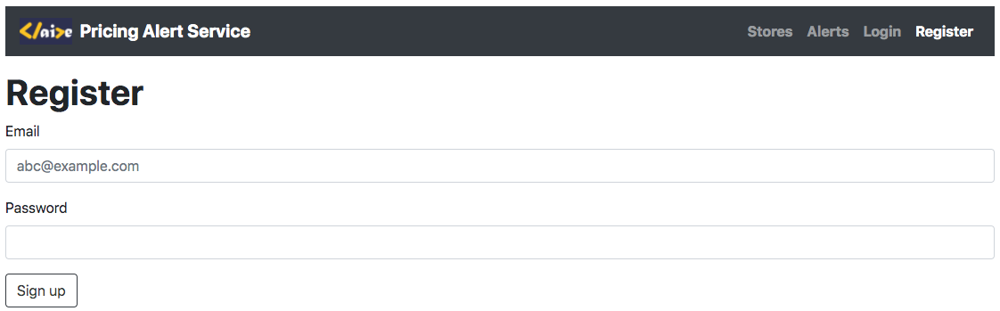
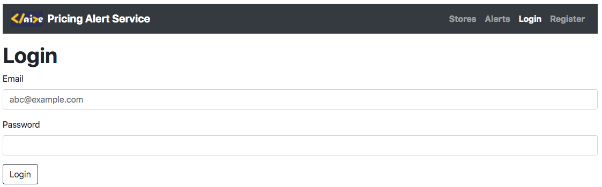
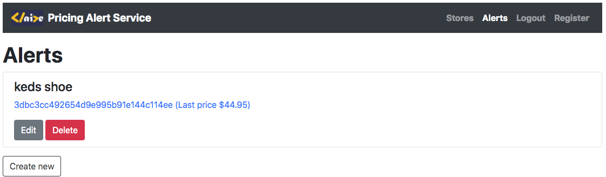
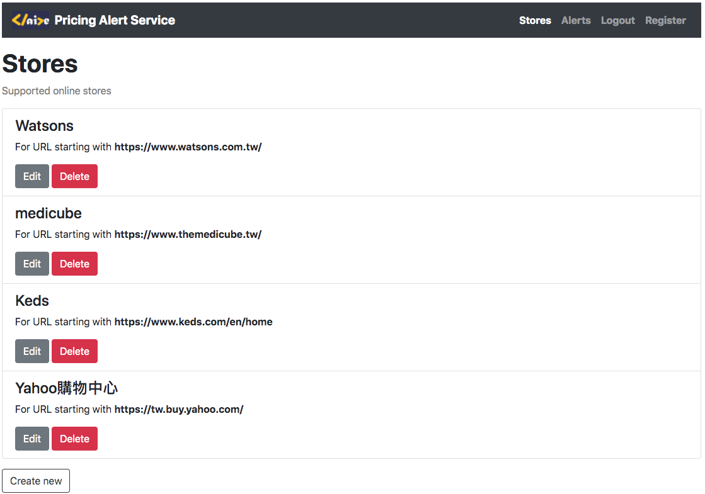

# Pricing-Alert-Service
[Pricing-Alert-Service Website](https://claire-pricing-alert-service.herokuapp.com/)

## Project Overview
### Project Description
Build a web application to scan the online stores periodically and notify users if price drop of items which they have set up are reached.
Users can add, remove, edit alerts, whereas only admin is allowed to add, remove, update online stores. 

### Project Technologies
- web framewrok: Flask
- database: mongoDB
- web scraping: BeautifulSoup
- front-end framework: Bootstrap
- third-party API: Mailgun

### Project Results

